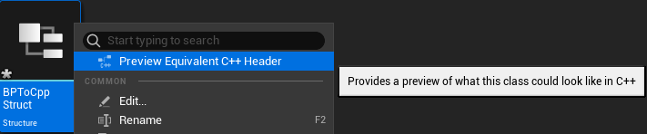
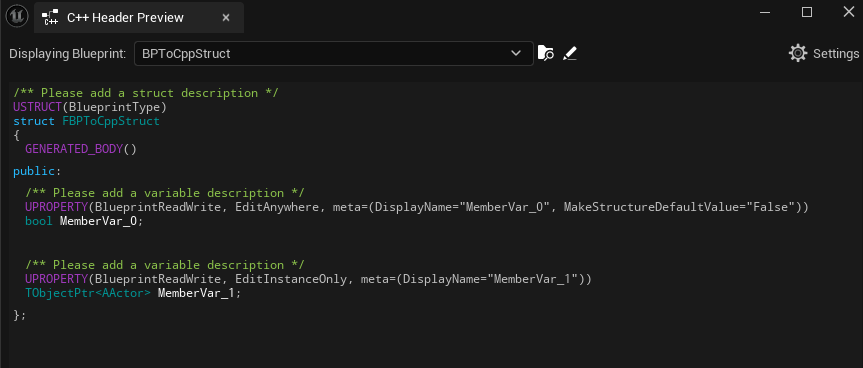

# 【UE5】（新手向）关于蓝图结构体

> 免责声明：
> 本文内容基于 UE 5.5，引擎内容在将来也许会有改变，不保证文章内容长期有效。

先说结论：**别用蓝图结构体**，项目中的每一个蓝图结构体都是一颗定时炸弹，可能会在将来的某个毁掉你的所有数据。

接下来说说为什么，以及如何正确地创建结构体（不需要任何 C++ 基础）。

## 原因

截至目前，蓝图结构体仍然存在大量 Bug，部分引擎功能无法兼容蓝图结构体。

一个常见的报错是结构体未知并打包失败，虽然你可以重命名你的结构体来修复这个问题，但是这会让所有相关数据变回默认值。

蓝图结构体是一种引擎资产（UUserDefinedStruct），和 C++ 中的结构体仅仅是看上去一样，作为一套独立的系统仅存在于蓝图层面，无法拥有继承关系和函数，难以在 C++ 里获取使用。

并且引擎中的某些功能可能不兼容蓝图结构体（比如`添加数据表行`这个节点，使用蓝图结构体时可能无效）。

## 如何正确创建结构体

> 这里假设你的结构体叫 `BPToCppStruct`

首先，按照官方文档安装好 Visual Studio：

[为虚幻引擎C++项目设置Visual Studio开发环境](https://dev.epicgames.com/documentation/zh-cn/unreal-engine/setting-up-visual-studio-development-environment-for-cplusplus-projects-in-unreal-engine)

先**临时**创建一个蓝图结构体，设置好变量，然后在内容浏览器右键这个结构体资产，选择预览 C++ 头文件，全选复制内容：




便能获得到 C++ 结构体的主体内容，接下来点击菜单栏的 工具 > 新建 C++ 类：

在弹出窗口选择任意类型, 下一步输入你结构体的名字（命名**不使用** a-z 、 A-Z 、 0-9 和 下划线_ 以外的其他字符），完成创建。

这会在你的项目文件夹下新建 Source 文件夹，新建 `BPToCppStruct.h` 和 `BPToCppStruct.cpp` 文件，并为你打开 Visual Studio。

我们需要删除掉 `BPToCppStruct.cpp` 这个文件，并把 `BPToCppStruct.h` 内容全部清空，换成以下的形式：

``` cpp
#pragma once

#include "BPToCppStruct.generated.h"// 这里的 BPToCppStruct 改成你结构体的名字

// 这下面是从 预览 C++ 头文件 粘贴过来的内容
/** Please add a struct description */
USTRUCT(BlueprintType)
struct FBPToCppStruct
{
	GENERATED_BODY()
public:
	/** Please add a variable description */
	UPROPERTY(BlueprintReadWrite, EditAnywhere, meta=(DisplayName="MemberVar_0", MakeStructureDefaultValue="False"))
	bool MemberVar_0;

	/** Please add a variable description */
	UPROPERTY(BlueprintReadWrite, EditInstanceOnly, meta=(DisplayName="MemberVar_1"))
	TObjectPtr<AActor> MemberVar_1;
};

```

> 另外如果要在 Data Table 中使用，有一行写法会有些不一样，
> 需要在类名后加上 ` : public FTableRowBase`，既：
>
> ``` cpp
> USTRUCT(BlueprintType)
> struct FBPToCppStruct : public FTableRowBase
> {
> ```

我们先关闭 UE，然后在 Visual Studio 里按 Ctrl+B 编译，完成之后就可以关闭 Visual Studio

这样一来，你就成功创建了一个久经考验的 C++ 结构体，用法和之前的蓝图结构体完全一致

## 蓝图枚举

基于类似的理由，蓝图枚举同样应该避免使用，使用 GameplayTag 或 C++ 枚举。

## 嘻嘻，我一定要用蓝图结构体

确实，使用蓝图结构体可能会出问题，使用蓝图结构体一定会出问题不太可能。

如果非要使用，在修改蓝图结构体资产的时候（无论是增加或删除变量、调整顺序，还是更改变量名和类型），先重启编辑器再使用。

关闭编辑器时，会提示你保存用到了该结构体的资产，选择**不保存**。

如果你保存了这些蓝图，在蓝图里点击 菜单栏 > 文件 > 刷新所有节点，并且重连全部存在问题的引脚。

> 如有疏漏不妥之处，还望不吝赐教。
>
> ---
>
> This work is licensed under CC BY-NC 4.0
